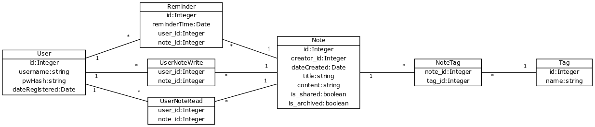

# Note app for tsoha course

This is a note taking / time tracing app that will be built as part of a university course project on databases. More detailed specification below in finnish.

## Muistiinpano- ja ajanseuraamisohjelma

Tarkoituksena on luoda ohjelma, jolla voi tehdä ja tarkastella muistiinpanoja, kuin myös seurata esimerkiksi kursseihin ja opiskeluun käytettyä aikaa tietyllä aikavälillä. Tässä vaiheessa tietokantakaaviossa on vasta pelkkiin muistiinpanoihin liittyvät taulut ja relaatiot. Alla listattuna ohjelmaan tässä vaiheessa liittyviä toiminnallisuuksia:

- Käyttäjä voi luoda itselleen käyttäjätunnuksen ja salasanan
- Käyttäjä voi kirjautua sisään tai ulos luodulla tunnuksella ja salasanalla
- Käyttäjä voi luoda uusia muistiinpanoja, jotka ovat oletuksena vain ne luoneen käyttäjän muokattavissa ja luettavissa
- Käyttäjä voi halutessaan jakaa muistiinpanon muiden käyttäjien kanssa, joko pelkällä lukuoikeudella tai myös kirjoitusoikeudella
- Muistiinpanoon lukuoikeudet omaava käyttäjä voi liittää muistiinpanoon muistutuksen, joka käytännössä aiheuttaa jonkinnäköisen muistiinpanoon liittyvän pop-upin ohjelman käyttöliittymässä määriteltynä ajanhetkenä
- Kirjoitusoikeudet olemassa olevaan muistiinpanoon omaava käyttäjä voi muokata muistiinpanon sisältöä, tai liittää siihen tageja
- Käyttäjä voi etsiä tagien avulla muistiinpanoja, joihin hänellä on lukuoikeus

Alla on tietokantakaavio, josta ilmenee taulut ja niiden relaatiot muistiinpanoihin liittyvälle toiminnallisuudelle. Tämä kaavio voi laajentua myöhemmin, jos/kun ohjelmaan tulee lisää toiminnallisuutta:

