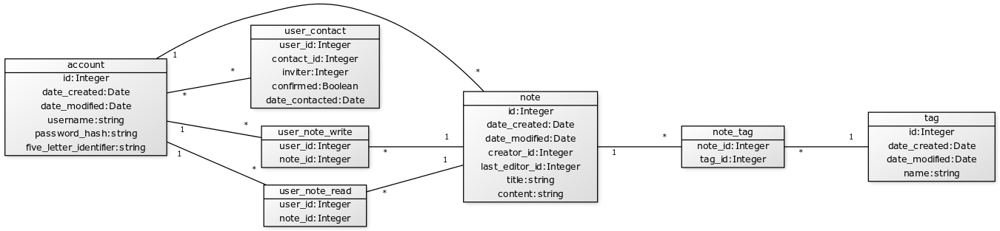

## Muistiinpano- ja ajanseuraamisohjelma

Ohjelma jolla voi tehdä ja tarkastella muistiinpanoja, kuin myös seurata esimerkiksi kursseihin ja opiskeluun käytettyä aikaa tietyllä aikavälillä. Tässä vaiheessa toiminnallisuus rajoittuu vain muistiinpanojen tekemiseen ja jakamiseen. Alla listattuna ohjelmaan tässä vaiheessa toteutettuja tai työn alla olevia toiminnallisuuksia:

- Käyttäjä voi luoda itselleen käyttäjätunnuksen ja salasanan
- Käyttäjä voi kirjautua sisään tai ulos luodulla tunnuksella ja salasanalla
- Käyttäjä voi nähdä listattuna kaikki muistiinpanot, joihin hänellä on lukuoikeus
- Käyttäjä voi luoda uusia muistiinpanoja, jotka ovat oletuksena vain ne luoneen käyttäjän muokattavissa ja luettavissa
- Käyttäjä voi muokata muistiinpanon sisältöä tai poistaa muistiinpanon, mikäli hänellä on siihen kirjoitusoikeus
- Käyttäjä voi liittää muistiinpanoon tageja, mikäli hänellä on siihen kirjoitusoikeus
- Käyttäjä voi etsiä tagien avulla muistiinpanoja, joihin hänellä on lukuoikeus
- Käyttäjä voi suodattaa muistiinpanoja vain tietyllä aikavälillä luotuihin tai päivitettyihin muistiinpanoihin (WIP)
- Käyttäjä voi lähettää kontaktipyyntöjä toiselle käyttäjälle, mikäli hänellä on hallussaan tämän viisikirjaiminen tunnistusmerkkijono
- Käyttäjä voi hyväksyä tai hylätä hänelle tulleen kontaktipyynnön. Hyväksyminen vahvistaa kahden käyttäjän välisen kontaktin
- Käyttäjä voi jakaa muistiinpanon kontaktilistallaan olevan käyttäjän kanssa, joko pelkällä lukuoikeudella tai myös kirjoitusoikeudella

Alla on tietokantakaavio, josta ilmenee taulut ja niiden relaatiot muistiinpanoihin liittyvälle toiminnallisuudelle. Tämä kaavio voi laajentua myöhemmin, jos/kun ohjelmaan tulee lisää toiminnallisuutta:

